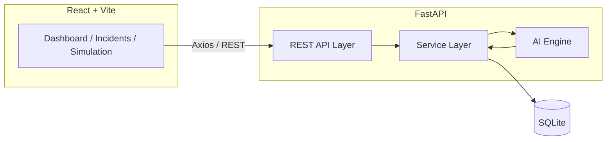
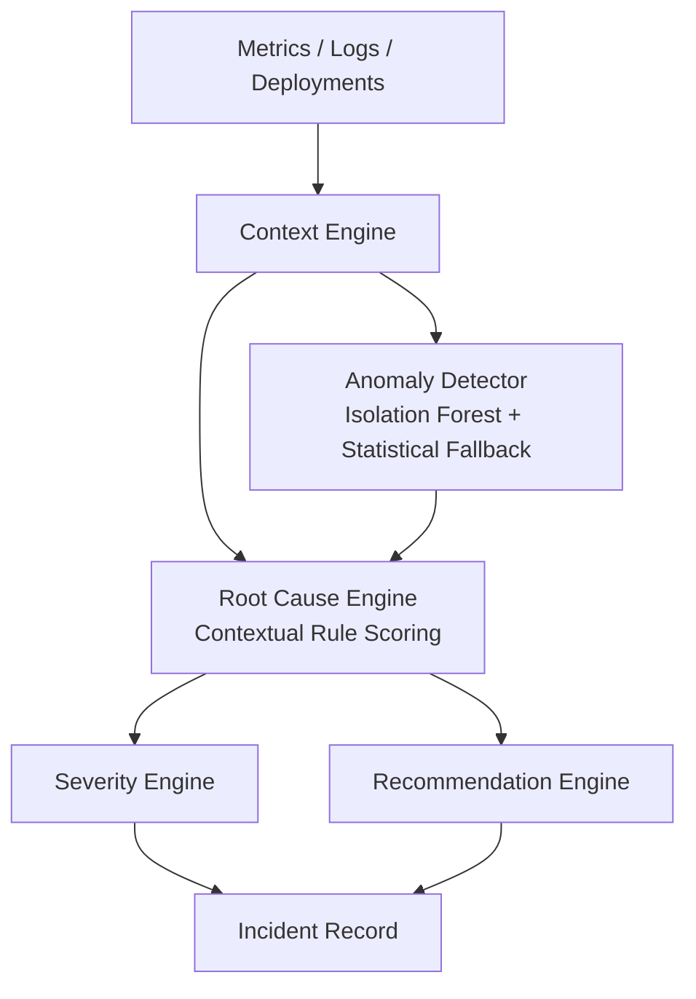
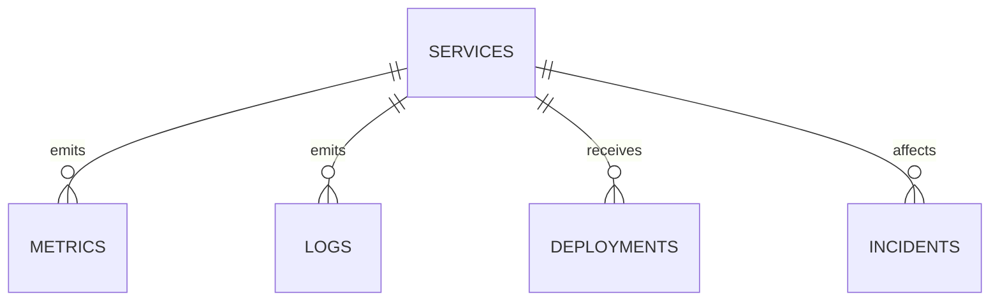

# CognitiveOps AI

**Context-Aware IT Root Cause Analysis & Decision Assistant**

CognitiveOps AI is a full-stack, hackathon-ready platform that ingests logs, metrics, deployments, and service telemetry, correlates them across time and context, and tells you what is actually broken — not just what is alarming.

---

## Table of Contents

1. [Overview](#overview)
2. [Problem Statement](#problem-statement)
3. [Proposed Solution](#proposed-solution)
4. [Key Features](#key-features)
5. [Architecture](#architecture)
6. [Technology Stack](#technology-stack)
7. [AI Methodology](#ai-methodology)
8. [Database Design](#database-design)
9. [API Documentation](#api-documentation)
10. [Installation](#installation)
11. [Backend Setup](#backend-setup)
12. [Frontend Setup](#frontend-setup)
13. [Running Instructions](#running-instructions)
14. [Simulation Instructions](#simulation-instructions)
15. [Screenshots](#screenshots)
16. [Future Enhancements](#future-enhancements)
17. [Hackathon Use Case](#hackathon-use-case)
18. [Team Contribution](#team-contribution)
19. [License](#license)

---

## Overview

Modern systems emit hundreds of alerts per incident. CognitiveOps AI ingests that noise — application logs, server/API/database metrics, deployment events, and service dependency data — and produces one answer: the probable root cause, its confidence, the supporting evidence, and what to do next.

## Problem Statement

A single underlying failure (e.g. database connection pool exhaustion) can fan out into dozens of symptoms: rising latency, timeouts, HTTP 500s, and user complaints. Engineers waste critical minutes triaging alerts that are all downstream of the same cause. Existing monitoring tools surface signals; they rarely correlate them into a single, explainable diagnosis.

## Proposed Solution

CognitiveOps AI builds a **context engine** that assembles a timestamp-ordered view of everything happening around a service (metrics, logs, deployments, historical incidents), scores every candidate root cause against that context using a combination of anomaly detection and contextual rules, and returns a ranked diagnosis with evidence and remediation steps — entirely with local, open-source ML (no paid LLM required).

## Key Features

- **Context-aware correlation** — signals are never evaluated in isolation; every root-cause rule combines multiple contextual factors (deployment recency, metric deltas, log content, anomaly scores).
- **Isolation Forest anomaly detection** with automatic statistical-threshold fallback when historical data is sparse.
- **Explainable AI** — every diagnosis ships with a confidence score, contributing-factor breakdown, and human-readable evidence.
- **Severity scoring** across service count, error rate, latency, anomaly magnitude, and business criticality.
- **One-click simulations** for six realistic incident scenarios, ideal for demos.
- **Full incident lifecycle** — OPEN → INVESTIGATING → MITIGATED → RESOLVED.
- **No paid APIs required** — runs entirely locally on SQLite + scikit-learn.

## Architecture





## Technology Stack

**Backend:** Python 3.11, FastAPI, Uvicorn, SQLAlchemy, Pydantic, SQLite, scikit-learn, pandas, numpy, httpx, python-dotenv

**Frontend:** React, Vite, Axios, React Router, Recharts, plain CSS (no TypeScript)

**Infrastructure:** Docker, Docker Compose

## AI Methodology

1. **Anomaly Detection** — an Isolation Forest is trained on historical metrics per service when at least 30 records exist; otherwise a z-score/threshold statistical model is used so the system never crashes on cold-start data.
2. **Context Engine** — merges current metrics, historical baselines, logs, deployments, and past incidents into one timeline and computes metric deltas (percentage change over the analysis window).
3. **Root Cause Engine** — scores nine candidate causes (`DATABASE_CONNECTION_EXHAUSTION`, `MEMORY_OVERLOAD`, `HIGH_CPU_USAGE`, `API_TIMEOUT`, `NETWORK_FAILURE`, `BAD_DEPLOYMENT`, `DEPENDENCY_FAILURE`, `DISK_SPACE_EXHAUSTION`, `UNKNOWN`) using rules that always combine multiple signals, never a single metric.
4. **Severity Engine** — combines affected-service count, error rate, latency, anomaly score, and business criticality into a 0–100 impact score mapped to LOW/MEDIUM/HIGH/CRITICAL.
5. **Recommendation Engine** — maps the winning root cause to concrete, actionable remediation steps.
6. **Model Manager** — orchestrates the pipeline end-to-end and exposes a stable interface so an external LLM could later be added purely as an enrichment step, without changing any existing contract.

## Database Design

| Table | Purpose |
|---|---|
| `services` | Monitored services and current health |
| `logs` | Application/infrastructure log entries |
| `metrics` | Time-series telemetry per service |
| `deployments` | Release/deployment events |
| `incidents` | Declared incidents with AI analysis results |
| `users` | Demo authentication |



## API Documentation

Interactive Swagger docs are generated automatically at **`/docs`** once the backend is running. Key endpoint groups:

- `GET /api/health`
- `GET /api/dashboard/summary`
- `GET|POST|PUT|DELETE /api/incidents`, `POST /api/incidents/{id}/analyze`, `POST /api/incidents/{id}/resolve`
- `GET|POST /api/logs`
- `GET|POST /api/metrics`, `GET /api/metrics/latest`, `GET /api/metrics/{service_name}`
- `GET|POST|PUT /api/services`
- `GET|POST /api/deployments`
- `GET /api/analysis/service/{service_name}`
- `POST /api/simulation/{normal|database-failure|memory-overload|bad-deployment|network-failure|api-timeout}`
- `POST /api/auth/login`

## Installation

Clone or unzip the project, then set up backend and frontend as described below.

## Backend Setup

```bash
cd backend
python -m venv venv
```

Activate the virtual environment:

```bash
# Windows
venv\Scripts\activate

# macOS / Linux
source venv/bin/activate
```

Install dependencies and run:

```bash
pip install -r requirements.txt
python run.py
```

The API starts at **http://localhost:8000**, with Swagger docs at **http://localhost:8000/docs**.

## Frontend Setup

```bash
cd frontend
npm install
npm run dev
```

The app starts at **http://localhost:5173**.

## Running Instructions

| Service | URL |
|---|---|
| Frontend | http://localhost:5173 |
| Backend API | http://localhost:8000 |
| Swagger Docs | http://localhost:8000/docs |

Demo login: `admin` / `admin123`

### Docker (optional)

```bash
docker compose up --build
```

This builds and runs both frontend and backend containers together. Docker is **not required** for local development.

## Simulation Instructions

1. Open the **Simulation** page in the sidebar.
2. Click any scenario button (e.g. **Database Failure**).
3. The backend generates realistic metrics, logs, and a deployment event, then immediately runs the AI analysis pipeline.
4. The resulting root cause, confidence, evidence, and recommendations render inline, and a link takes you to the full incident details page with the timeline.

## Screenshots

_Add screenshots here:_

- `docs/screenshots/dashboard.png`
- `docs/screenshots/incident-details.png`
- `docs/screenshots/simulation.png`

## Future Enhancements

- Optional LLM-based enrichment layer (hook already present in `model_manager.py`)
- Multi-service cascade detection across dependency graphs
- Slack/webhook alerting integration
- PostgreSQL production deployment with connection pooling
- Role-based access control beyond the demo login

## Hackathon Use Case

CognitiveOps AI demonstrates end-to-end context-aware incident diagnosis without any paid infrastructure — ideal for judges to click through a live, working system in minutes: open the dashboard, trigger a simulated database failure, and watch the AI identify the root cause with evidence and next steps.

## Team Contribution

_Add your team's contribution breakdown here (e.g. backend, AI engine, frontend, deployment)._

## License

MIT License. Free to use, modify, and distribute for hackathon and educational purposes.
